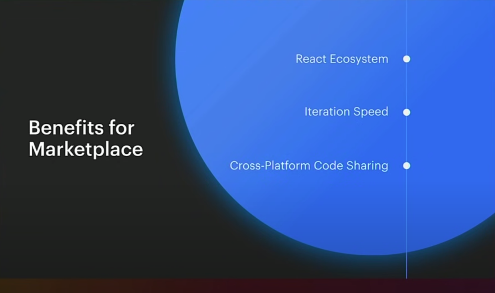
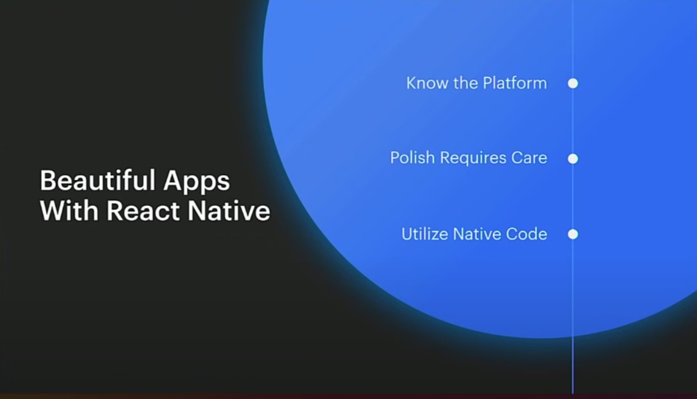
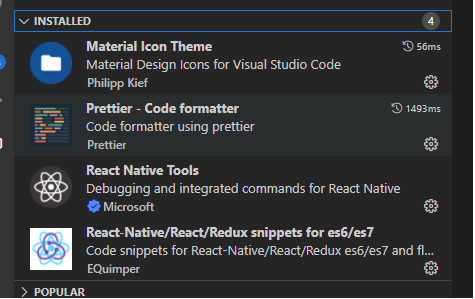

# react-native

Basic to learning react native

### What is react native

**Facebook** released React Native in 2015 and has been maintaining it ever since.


#### Create native apps for Android and iOS using React

**Use a little—or a lot**. You can use React Native today in your existing Android and iOS projects or you can create a whole new app from scratch.


#### Written in JavaScript—rendered with native code

React primitives render to native platform UI, meaning your app uses the same native platform APIs other apps do.

**Many platforms**, one React. Create platform-specific versions of components so a single codebase can share code across platforms. With React Native, one team can maintain two platforms and share a common technology—React.

### Setup Environment

#### install expo-cli

```
npm i -g expo-cli
```

#### install expo client to the phone

#### install VS code and extensions


#### Start Android Emulator
```
sdk\emulator> emulator.exe -avd Pixel4  (Pixel4 can use -list-avds)
```

### Create demo project

#### expo init

```
expo init DoneWithIt
√ Choose a template: » blank     a minimal app as clean as an empty canvas
```

choose the Android, and if you want to run remote debug. Run ```control + M```


### React native components and apis
Details please visit https://reactnative.dev/docs/components-and-apis

